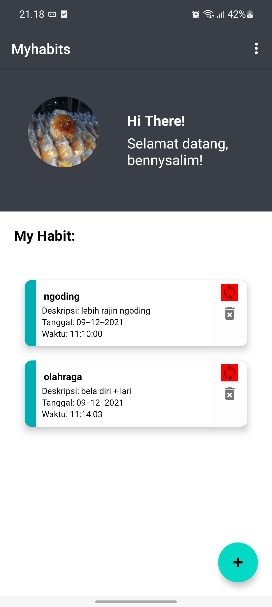
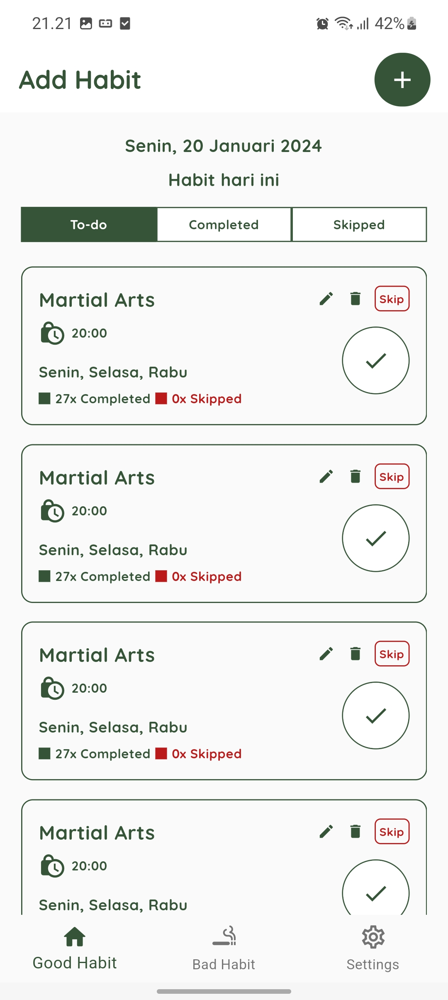

# What is My Habits 2.0?

My habits 2.0 app is inspired from first myhabits 1.0 by android native mobile development project from [this repository](https://github.com/bennysalim/CStudio_IF570_D_UAS_MyHabits). The purpose of this project is to convert FE framework by using Flutter for Android & iOS (clone the project and build the .ipa file), feature and also user interface (UI/UX) improvement.

**From this**



**To this**



## Getting Started : I want to try this project locally

Before you start using this project, you have to  download Flutter SDK from [Flutter Official Website Here](https://flutter.dev) also Android/iOS SDK included in your machine.

After above, you can use this Flutter project to build new .apk/.ipa file by cloning the project

```git clone https://github.com/bennysalim/myhabitsv2-flutter```

Next you have to get the dependencies because this repository project doesn't already include the package by go to the terminal, change directory to ```cd myhabitsv2-flutter```, and get the dependencies using Flutter CLI ```flutter pub get```.

Next you can run the app from lib/main.dart from your VSCode/IntellIJ IDEA using smartphones/emulator.